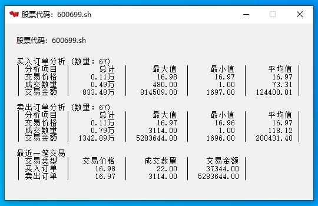

# StockAnalyzer

这是一个分析股票交易数据的小工具

支持多语言，默认同系统语言

## windows构建步骤

### 环境要求

1. Visual Studio 2022

2. vcpkg

3. cmake

### 开始构建

1. 使用`VCPKG`安装依赖

    ```bash
    vcpkg install wxwidgets:x64-windows-static
    vcpkg install curl:x64-windows-static
    ```

2. 在`CMakeLists.txt`中修改你的`VCPKG_INSTALL_DIR`目录，然后构建项目

3. 使用`cmake`构建项目

    打开`cmake-gui.exe`，设置好源码目录和构建目录，点击`Configure`开始构建。

    随后点击`Generate`生成vs项目

4. 编译程序

    到此你可以根据自己的需求修改源码，并编译程序了

## 懒人福利

如果你不想自己构建，那么我在`example/build`放了构建好的项目

如果还赖的自己编译，那么我在`example/release`放了编译好的程序

## 效果展示

1. 主界面

    

2. 结果界面

    

—— ByteSharky
***
